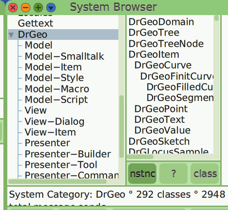

# Package
*By Hilaire Fernandes*

## Search path 
The `Feature require: 'myGreatPackage'` searches for the package file
`'myGreatPackage'` and installs it. Cuis searches in some default path
directions. 

Let's suppose your Cuis-Smalltalk environment is installed in the
`Cuis-Current/Cuis-Smalltalk-Dev` directory.

* in the `myGreatPackage` directory, ??? **I don't understand the
  rational behind. IT does not seem to work**

* in the `Packages` folder and its sub-folders of your Cuis
  installation: `Cuis-Current/Cuis-Smalltalk-Dev/Packages`.

* In the user's Package folder as defined by Cuis and the default
  place where a newly created package is saved:
  `/Cuis-Current/Cuis-Smalltalk-Dev-UserFiles/NewPackages`

* In the parent folder and sub-folders of your Cuis installation:
  `Cuis-Current`

Reference:  method `placesToLookForPackagesDo:`

## Split a Package
In a project whose code is hosted in a single package file, when the
project grows, you may want to split it in several packages to ease
reuse.

For example in this ``DrGeo`` package, 

You may want to split in ``DrGeo-Model`` package for the *DrGeo-Model*
class category and ``DrGeo`` package for the other part of the code.

So you can have packages called ``DrGeo-Model``, ``DrGeo-View``,
etc. and one called ``DrGeo`` if you want, it works.  You can also
have packages called ``DrGeoModel``, ``DrGeoView``, etc. then
``DrGeo`` but they will appear as different categories.

Réf. <https://lists.cuis.st/mailman/archives/cuis-dev/2026-January/011521.html>
